# Proyecto integrador M2
## Desarrollo de un Agente Inteligente con Memoria y Arquitectura Justificada

## Contenido
[1. OBJETIVO GENERAL](#1-objetivo-general)

[2. ALCANCE DEL PROYECTO](#2-alcance-del-proyecto)

[3. PROBLEMA O DOLOR DEL NEGOCIO](#3-problema-o-dolor-del-negocio)

[4. ANALISIS PREVIO](#4-analisis-previo)

[5. ARQUITECTURA DE SOLUCION](#5-arquitectura-de-solucion)

[6. COMPONENTES QUE DEBEN EXPLICARSE](#6-componentes-que-deben-explicarse)

[7. CONTROLES MINIMOS ESPERADOS](#7-controles-minimos-esperados)

[8. LANGSMITH](#8-langsmith)

[9. ENTREGABLES](#9-entregables)

[10. CRITERIO PRINCIPAL DE EVALUACION](#10-criterio-principal-de-evaluacion)

---

*Documentación elaborado por [Hadson Paredes](https://www.linkedin.com/in/hadson-paredes/) - 2026*
- Repositorio: [Project-Agentic-AI-Virtual-Medical-Assistant](https://github.com/devhadson/Project-Agentic-AI-Virtual-Medical-Assistant)
- Elaboración: ASISTENTE VIRTUAL MÉDICO IA
  - Proceso de triaje y gestión de Agendamiento para pacientes endocrinos (específicamente en control de diabetes)
  - Arquitectura: Híbrida (Determinista y Agéntica)
  - Modelo Fundacional IA: OpenAI (`gpt-4o`)
  - Contexto, Prompting y Orquestación de Agentes: LangChain Framework
  - Frontend: Streamlit Framework 
  - Uso de datos: Datos sinteticos (formato `.CSV`)
- Especialización: IA Engineer y Arquitetura de Sistemas Generativos 
- Docentee: [Miguel Angel Cotrina Espinoza](https://www.linkedin.com/in/mcotrina/)
- [Instituto de Datos e Inteligencia Artificial - URP](https://www.linkedin.com/company/idia-urp/)

---

## 1. OBJETIVO GENERAL

El **objetivo principal** del ASISTENTE VIRTUAL MÉDICO IA es **optimizar el triaje y la gestión de Agendamiento del pacientes endocrinos (específicamente en control de diabetes)** mediante una _arquitectura híbrida_ que combina **reglas de negocio deterministas y agentes inteligentes basados en LLMs (Modelos de Lenguaje de Gran Tamaño).**

El sistema busca maximizar la eficiencia clínica y garantizar la seguridad del paciente mediante dos enfoques complementarios:

### 1. El Componente Determinista (Eficiencia y Seguridad Inmediata)

Su objetivo es **clasificar sin ambigüedades** la gravedad del paciente basándose estrictamente en su nivel de glucosa en sangre, actuando como un primer filtro endocrino rápido:

* **Para Valores Críticos Altos (> 250 mg/dL - Urgencias):** Automatiza la entrega de órdenes y requisitos de laboratorio sin consumir recursos de IA.
* **Para Valores Críticos Bajos (< 70 mg/dL ó > 70 mg/dL):** Enruta de forma segura al paciente hacia el agente conversacional idóneo según su nivel de riesgo.

### 2. El Componente Agéntico (Interacción Humana e Inteligente)

Su objetivo es **gestionar el diálogo adaptativo y ejecutar acciones reales en el sistema** mediante herramientas (`tools`) cuando las condiciones del paciente requieren flexibilidad cognitiva:

* **Agente de Emergencia:** Estabiliza e interroga de forma dirigida al paciente en _shock hipoglucémico (o hipoglucemia grave)_ para recopilar data crítica y activar forzosamente alertas médicas mediante `trigger_doctor_emergency_alert`.
* **Agente de Agendamiento:** Razona sobre catálogos médicos en formato CSV y reglas complejas de horarios para asistir al paciente en la reserva automática de su cita mediante `save_appointment_to_csv`.

### Objetivos Secundarios Operacionales

* **Gobernanza de Datos y Seguridad:** Controlar el acceso al sistema mediante 3 roles diferenciados (Paciente, Enfermera, Médico) asegurando que los pacientes solo puedan auditar su propio historial, mientras que el personal médico accede al cuadro general.
* **Monitoreo Clínico:** Suministrar un panel analítico (Dashboard) para que las enfermeras y médicos puedan observar la distribución de alertas, optimizando la toma de decisiones en el centro de salud.

## 2. ALCANCE DEL PROYECTO

El alcance de este proyecto comprende el diseño e implementación de un **ASISTENTE VIRTUAL MÉDICO IA** (Sistema Web integral IA), desarrollado con _Python_ y _Streamlit_, que automatiza el **triaje de control de diabetes** y agiliza la **gestión de citas en endocrinología.** La parte funcional abarca desde la autenticación segura segregada por tres roles (pacientes, enfermeras y médicos) hasta el almacenamiento de transacciones en _archivos locales de tipo CSV_ (primera versión o MVP1). La solución despliega un _motor determinista_ que intercepta y evalúa instantáneamente los niveles de glucosa en sangre del paciente, permitiendo resolver casos de urgencias severas de manera estricta y procedimental, sin llamadas a la **inteligencia artificial, reduciendo los costos de API y eliminando el riesgo latente de alucinaciones.**

Asimismo, el proyecto abarca el desarrollo de capacidades agénticas avanzadas mediante el **framework _LangChain_ y modelos fundacionales de _OpenAI_,** orientadas a gestionar conversaciones empáticas y adaptativas con los usuarios. Este componente inteligente incluye la orquestación de dos agentes especializados con _temperatura cero_: **uno enfocado en estabilizar pacientes en crisis hipoglucémicas y disparar alertas médicas inmediatas (triaje de control de diabetes)**, y otro **encargado de negociar autónomamente los horarios de reserva (gestión de citas en endocrinología)** cruzando catálogos de profesionales disponibles. Finalmente, el alcance cierra con un **módulo de analítica que proporciona dashboards dinámicos (reportes)** para que el personal de salud monitoree la distribución de alertas en tiempo real.

## 3. PROBLEMA O DOLOR DEL NEGOCIO

**Explicación del problema:**

Los centros de atención primaria y los pacientes diabéticos enfrentan un desafío crítico con el triaje de niveles de glucosa, que actualmente es un proceso manual, lento y propenso a errores humanos. Esta falta de eficiencia retrasa la respuesta ante emergencias potencialmente mortales (como la hipoglucemia grave), **sobrecarga innecesariamente los servicios de urgencias** con casos manejables y dificulta un seguimiento preventivo y personalizado. La solución de Asistente Virtual Médico IA aborda esta problemática mediante una _arquitectura híbrida_: un **motor determinista que clasifica los casos de forma instantánea y segura**, y un **agente conversacional inteligente** que, solo en emergencias críticas, recopila contexto clínico vital, ofrece mitigación inmediata y alerta automáticamente al médico, garantizando así una atención rápida, precisa y centrada en el paciente.

**A: ¿Qué problema tiene la empresa o usuario?**
Retrasos peligrosos en el triaje de glucosa y sobrecarga de servicios médicos por falta de automatización crítica.

**B: ¿Qué proceso manual, lento o repetitivo se busca mejorar?**
La clasificación manual y repetitiva de niveles de glucosa, que es lenta y propensa a errores humanos.

**C: ¿Qué impacto genera actualmente ese problema?**
Riesgos vitales para el paciente, aumento de costos operativos y uso ineficiente de los recursos de salud.

**D: ¿Por qué una solución con IA Generativa puede aportar valor?**
La IA aporta valor mediante un agente conversacional para guiar al usuario solo en emergencias graves.

**E: ¿Qué resultado espera obtener el usuario**
Atención médica automatizada, diagnósticos más rápidos y seguros, con un seguimiento preventivo y personalizado de su enfermedad.

## 4. ANALISIS PREVIO

En esta fase de descubrimiento o *Discovery Técnico* evaluaremos las tecnologías o herrmientas más importante antes de iniciar el desarrollo o comenzar con la primera línea de código o estructurar los diagramas de arquitectura. En base a los dolores del negocio identificados y los objetivos clínicos según los **requerimientos técnicos, restricciones y vectores de riesgo** se detalla el análisis previo y exhaustivo realizado estrictamente en el marco estratégico de tu solución:

---

### 4.1. Mapeo de Entidades y Modelado de Datos Relacionales

Antes de diseñar la base de datos transaccional (inicialmente simulada en CSV), se deben definir con claridad las fronteras del modelo de información para evitar la corrupción de datos y asegurar la trazabilidad.


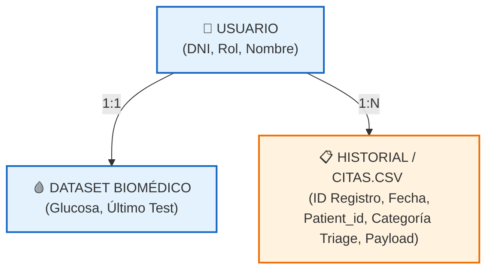


* **Entidades Críticas Identificadas:**
* `Usuario`: Define la identidad y el perímetro de seguridad (`DNI`, `Password`, `Rol` [Paciente, Enfermera, Médico], `Display_Name`).
* `Biometría (pacientes.csv)`: Contiene la variable reina del negocio (`patient_id`, `glucose_level`). Requiere acoplamiento directo de lectura 1:1 con el DNI del paciente autenticado.
* `Catálogo Médico (medicos.csv)`: Datos de referencia estáticos utilizados exclusivamente como contexto de lectura para el LLM (`id_medico`, `nombre`, `especialidad`).
* `Transacciones (citas.csv)`: El libro contable/médico central del sistema donde se unifican los resultados tanto de los flujos deterministas como agénticos.


---

### 4.2. Matriz de Concurrencia y Criticidad Operacional

El análisis de los dolores del negocio ("retrasos peligrosos", "riesgos vitales") exige clasificar los flujos según su nivel de tolerancia a fallos y latencia:

| Componente | Tipo de Proceso | Tolerancia a Fallos / Alucinación | Requerimiento de Latencia | Infraestructura Crítica |
| --- | --- | --- | --- | --- |
| **Triaje de Glucosa** | Determinista (Pandas) | **0%** (Ninguna) | < 500 ms (Inmediato) | Local / Servidor de Reglas |
| **Gestión de Crisis** | Agéntico (LLM + Tool) | Baja (Alineación estricta por prompt) | < 2.0 segundos (Conversacional) | OpenAI API + Hilo de Alerta |
| **Agendamiento** | Agéntico (LLM + Tool) | Media-Baja (Validación horaria) | < 3.0 segundos | OpenAI API + I/O de Archivos |
| **Auditoría / Dashboard** | Analítico (Streamlit) | Baja (Integración de datos) | On-demand (Al cargar módulo) | Memoria del Servidor Web |

---

### 4.3. Análisis de Capacidades Lingüísticas y Requerimientos del LLM

El "Componente Agéntico" requiere un modelo fundacional que no solo sea capaz de generar texto empático, sino que posea habilidades avanzadas de **Razonamiento y Selección de Herramientas (*Tool Calling / Function Calling*)**.

* **Criterio de Selección del Modelo:** El modelo elegido debe soportar de forma nativa `.bind_tools()`. Modelos menores o no optimizados tienden a fallar al estructurar los argumentos JSON necesarios para invocar funciones como `save_appointment_to_csv`.
* **Gestión del Estado Conversacional (Memory Overhead):** Debido a que el paciente en shock hipoglucémico o en proceso de agendamiento interactuará en múltiples turnos de palabra, el prompt del sistema debe diseñarse con un `MessagesPlaceholder`. El análisis previo determina que el historial de chat debe ser truncado o resumido si la conversación excede los 10 turnos para evitar el aumento drástico en el costo de tokens de entrada.

---

### 4.4. Perímetro de Seguridad, Gobernanza y Roles (RBAC)

Para dar solución a los objetivos secundarios de gobernanza, se establece la matriz de control de acceso basada en roles (RBAC) antes de estructurar las vistas de la aplicación:

* **Rol Paciente:** * *Lectura:* Limitada exclusivamente a sus propios registros de glucosa y su propio historial en `citas.csv` filtrado por su DNI en la sesión web.
  * *Escritura:* Solo permitida a través de la mediación del Agente Inteligente (ningún paciente puede escribir directamente en el CSV sin la validación de la IA).


* **Rol Enfermera / Médico:**
  * *Lectura:* Acceso irrestricto y global a la base de datos completa de `citas.csv`.
  * *Visualización:* Permiso exclusivo para renderizar el módulo de Dashboard Analítico (`st.bar_chart`, `st.metric`).


---

### 4.5. Árbol de Decisiones de la Arquitectura Híbrida (Desacoplamiento Operacional)

El análisis previo define que la arquitectura debe actuar como un interruptor de energía (*Circuit Breaker*). La IA no debe ser un componente omnipresente; debe ser un componente bajo demanda.

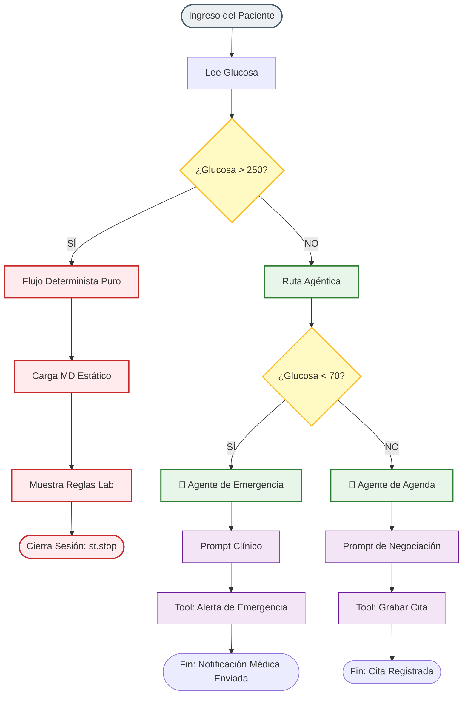

---

### 4.6. Brechas Identificadas y Mitigaciones en el Diseño (Risk Assessment)

Tras analizar los dolores ("errores humanos", "sobrecarga de servicios"), se identifican los siguientes riesgos de diseño que la arquitectura final debe mitigar:

1. **Riesgo de Duplicidad de Citas:** Al ser una interfaz conversacional libre, el paciente podría decirle al agente "agenda la cita" múltiples veces en el mismo chat.
* *Mitigación analítica:* La herramienta `save_appointment_to_csv` debe ser diseñada para validar de forma determinista en Python si el payload o el usuario ya cuenta con un registro en la última hora antes de anexar la fila.


2. **Riesgo de Manipulación Conversacional (Prompt Injection):** Un paciente simulando una glucosa normal podría intentar confundir al LLM para activar alertas de emergencia falsas.
* *Mitigación analítica:* La disponibilidad de las herramientas se encuentra segregada a nivel de código de orquestación (`tools = [trigger_doctor_emergency_alert]` vs `tools = [save_appointment_to_csv]`). Si el paciente fue clasificado en el flujo de agendamiento, el prompt de agenda no tiene acceso físico al tool de emergencia, bloqueando de raíz cualquier intento de escalada de privilegios agénticos.


3. **Persistencia Concurrente:** El uso de archivos CSV locales como almacenamiento expone al sistema a bloqueos de archivos si dos procesos intentan escribir al mismo tiempo.
* *Mitigación analítica:* Se establece como requerimiento mínimo inicial encapsular las funciones de escritura de las herramientas en bloques de captura de excepciones globales (`try-except`) para evitar la caída catastrófica de la interfaz de Streamlit.

---

## 5. ARQUITECTURA DE SOLUCION

Se detalla la documentación arquitectónica de la solución del **Asistente Virtual Médico IA**, deistribuida en capas de Arquitectura según la Tecnología.

---

### 5.1. Capas de Arquitectura según tecnología seleccionado

La aplicación se rige una Arquitectura híbrida desacoplada en 5 capas especializadas, utilizando el ecosistema de Python como núcleo de ejecución principal:

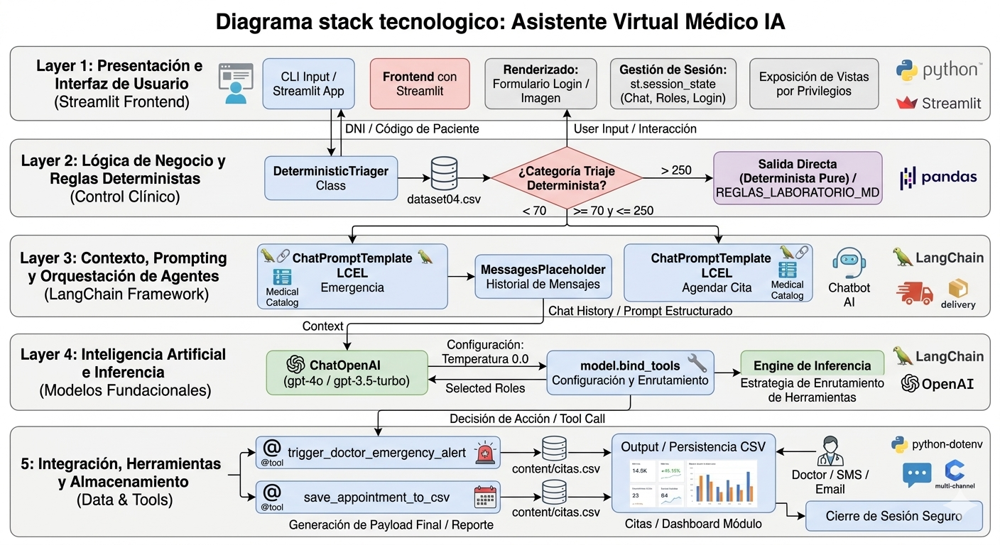

A continuación se describe cada capa de la arquitectura según tecnología:

* **Capa 1: Presentación e Interfaz de Usuario (Streamlit Frontend)**
  * **Tecnología:** `streamlit` (UI), CSS embebido dinámico (`st.markdown`).
  * **Función:** Renderiza el formulario de autenticación en doble columna (login e imagen), gestiona la persistencia del estado en la interfaz mediante `st.session_state` (historial de chat, login, roles) y expone las vistas según privilegios de usuario.


* **Capa 2: Lógica de Negocio y Reglas Deterministas (Control Clínico)**
  * **Tecnología:** `pandas` (Motor de Dataframes).
  * **Función:** Filtra y evalúa de forma algorítmica e inequívoca las variables biomédicas del paciente (niveles de glucosa en `pacientes.csv`). Clasifica los estados en tres ramificaciones rígidas: *Emergencia*, *Urgencias* y *Agendar Cita*, bloqueando el acceso al LLM si el caso es puramente procedimental (Urgencias).


* **Capa 3: Contexto, Prompting y Orquestación de Agentes (LangChain Framework)**
  * **Tecnología:** `langchain_core` (`ChatPromptTemplate`, `MessagesPlaceholder`).
  * **Función:** Ensambla dinámicamente las directrices del sistema (`SystemMessage`) inyectando contextos variables del negocio médico (médicos disponibles en Markdown, reglas horarias e historial en memoria activa `chat_history`).


* **Capa 4: Inteligencia Artificial e Inferencia (Modelos Fundacionales)**
  * **Tecnología:** `langchain_openai` (`ChatOpenAI`), API de OpenAI.
  * **Función:** Ejecuta los modelos de lenguaje masivos (`gpt-4o` o `gpt-3.5-turbo`) parametrizados con temperatura cero ($0.0$) para mitigar alucinaciones. Coordina la capacidad de enlace lógico de herramientas mediante `bind_tools`.


* **Capa 5: Integración, Herramientas y Almacenamiento (Data & Tools)**
  * **Tecnología:** `python-dotenv` (Seguridad), `pandas` (I/O Local CSV), decorador `@tool` de LangChain.
  * **Función:** Persiste las transacciones conversacionales y los payloads analíticos en la base de datos plana local (`citas.csv`). Ejecuta funciones nativas del sistema (`save_appointment_to_csv` o `trigger_doctor_emergency_alert`) cuando el LLM decide invocar una acción.


---

### 5.2. Diagrama de Arquitectura en Capas

Este diagrama representa el flujo de datos vertical a través de los componentes del software:

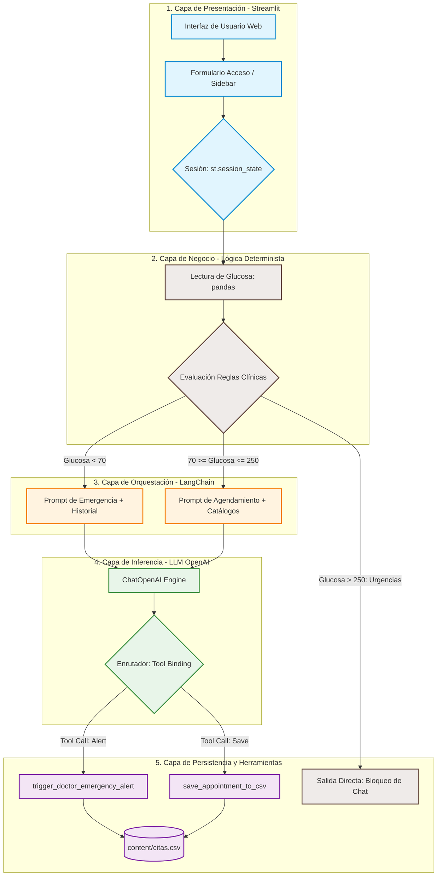

---

### 5.3. Diagrama de Flujos: Determinista y Agéntico

Este diagrama modela la bifurcación inicial del algoritmo (reglas puras) y la transición hacia el bucle de toma de decisiones del agente autónomo.

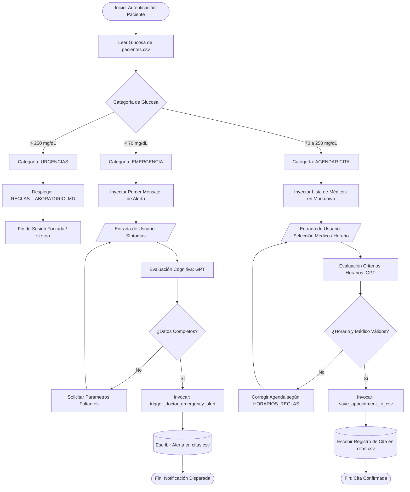

---

### 5.4. Tabla de Estados del Flujo de Trabajo

El ciclo de vida de la aplicación se gestiona de acuerdo a la siguiente máquina de estados finitos distribuidos en las variables de control:

| Estado Origen | Evento / Condición de Transición | Acción Ejecutada por el Sistema | Estado Destino | Variables Afectadas en `st.session_state` |
| --- | --- | --- | --- | --- |
| **No Autenticado** | Envío de formulario válido en `login_form` cruzando DNI con `usuarios.csv`. | Valida credenciales e inicializa sesión de usuario. | **Autenticado** | `logged_in = True`<br>`username = DNI`<br>`rol = "paciente"/"médico"` |
| **Autenticado** | Identificación de rol igual a `"paciente"` y ausencia de categoría registrada. | Consulta el archivo `pacientes.csv` para extraer la métrica de glucosa. | **Triaje Evaluado** | `glucose_level = float`<br>`triage_category = STR` |
| **Triaje Evaluado** | Glucosa medida es estrictamente mayor a $250.0\text{ mg/dL}$. | Interrumpe la creación del Agente. Renderiza `REGLAS_LABORATORIO_MD`. | **Bloqueo / Urgencia Procedimental** | `triage_category = "URGENCIAS"`<br>`action_message = "Solicitar Orden..."` |
| **Triaje Evaluado** | Glucosa medida es menor a $70.0\text{ mg/dL}$. | Instancia el LLM enrutado a `trigger_doctor_emergency_alert` e inicializa la cola de chat de urgencia. | **Bucle Agéntico: Emergencia** | `triage_category = "EMERGENCIA"`<br>`chat_history = [AIMessage]` |
| **Triaje Evaluado** | Glucosa medida se encuentra entre $70.0\text{ mg/dL}$ y $250.0\text{ mg/dL}$. | Instancia el LLM acoplado a `save_appointment_to_csv` cargando el catálogo médico en el sistema. | **Bucle Agéntico: Agenda Activa** | `triage_category = "AGENDAR CITA"`<br>`chat_history = [AIMessage]` |
| **Bucle Agéntico: Emergencia** | El LLM deduce que se han respondido las preguntas obligatorias sobre síntomas y consumos. | Invoca por debajo del diálogo la función de alerta médica crítica. | **Notificación Concluida** | `chat_history = +[AIMessage con Alerta]` |
| **Bucle Agéntico: Agenda Activa** | El LLM valida que la fecha elegida cumple las `HORARIOS_REGLAS` y el médico existe. | Ejecuta la persistencia física de la cita médica en formato CSV. | **Agenda Concluida** | `chat_history = +[AIMessage Exitoso]` |
| **Cualquier Estado** | Pulsación del botón `"Cerrar Sesión Segura"` en la barra lateral. | Destruye el diccionario de sesión actual y fuerza la recarga de página. | **No Autenticado** | Limpieza total mediante `st.session_state.clear()` |

## 6. COMPONENTES PRINCIPALES

En el desarrollo del ASISTENTE VIRTUAL MÉDICO IA para pacientes endocrinos con diabetes, se aplican todos los componentes de una arquitectura agéntica avanzada (Orquestador, Dispatcher, Workflows, Agente y Herramientas), que están implementados de forma clara y funcional en esta solución.

La solución del Asistente Virtual Médico IA logra separar la lógica determinista (valores endocrinos) de la lógica agéntica (razonamiento conversacional) utilizando el Framework de LangChain (LCEL) y Streamlit para la persistencia.

A continuación, se detalla cada componente basándome estrictamente en la solución de desarrollada:

---

### Extracción y Resumen de Componentes

#### Orquestador (Orchestrator)

Es el componente de más alto nivel que decide qué tipo de flujo de trabajo activar (híbrido).

* **Extracción en el Código:** Este componente reside en la lógica de Streamlit (`if selected_modulo == "Triaje / Agendamiento"`), específicamente en el bloque de "Lógica Determinista de Triaje (Solo aplica a Pacientes)".
* **Resumen:** El orquestador es determinista. Lee la glucosa del paciente y ejecuta una bifurcación rígida: si el nivel es mayor a $250\text{ mg/dL}$, finaliza la sesión tras mostrar el Markdown de `REGLAS_LABORATORIO_MD`; de lo contrario, orquesta la instanciación de los componentes agénticos, configurando los *prompts* y *tools* específicos para **Emergencia** o **Agendar Cita**.

#### Dispatcher (Despachador)

Es el encargado de configurar, vincular y arrancar el motor de inferencia de IA, asegurando que el agente tenga las instrucciones y herramientas correctas.

* **Extracción en el Código:** Se localiza en la línea que ensambla la cadena LCEL (LangChain Expression Language):
  ```python
  agent_chain = prompt_template | llm.bind_tools(tools)
  ```

  Donde `bind_tools` actúa como el despachador de las capacidades cognitivas del LLM.
* **Resumen:** El dispatcher toma las directrices de orquestación (qué prompt usar y qué tools vincular) y "prepara" al modelo de OpenAI (`ChatOpenAI`) mediante `bind_tools`. Al hacerlo, le enseña al modelo la "firma" de las funciones nativas de Python que puede invocar, pero no las ejecuta todavía.

#### Flujos de Trabajo (Workflows - LCEL)

Es la definición secuencial de pasos y el manejo del estado (memoria) que guiará la conversación.

* **Extracción en el Código:** Se define mediante el operador `|` de LangChain:
  
  ```python
  # Definición
  prompt_template | llm.bind_tools(tools)
  # Ejecución y manejo de estado (chat_history)
  response = agent_chain.invoke({"chat_history": st.session_state["chat_history"]})
  ```

* **Resumen:** El flujo de trabajo no es conversacional alucinatorio; **es un Workflow LCEL estructurado.** Su objetivo es asegurar la inyección correcta del `MessagesPlaceholder(variable_name="chat_history")` en el prompt. Toma el historial dinámico de la sesión de Streamlit, alimenta al modelo y devuelve una respuesta estructurada que puede o no contener un `Tool Call`.

#### Agente (Agent)

Es el componente cognitivo central (OpenAI gpt) que decide dinámicamente el siguiente paso basándose en el historial y el prompt.

* **Extracción en el Código:** Representado por las instancias de `ChatOpenAI`:

  ```python
  llm = ChatOpenAI(model=selected_model, temperature=selected_temp)
  ```

* **Resumen:** Es el cerebro del sistema. Basado en el `selected_model` (gpt-4o) y parametrizado por el `Sidebar` de Streamlit (temperatura, modelo), el agente razona sobre la entrada del usuario. Su objetivo es decidir, de manera agéntica/dinámica, si puede responder con texto natural o si requiere "salir" del modelo para invocar forzosamente una de las herramientas vinculadas.

#### Herramientas (Tools - Actions)

Son las funciones nativas de Python que permiten al sistema híbrido interactuar con el mundo real (persistencia en CSV).

* **Extracción en el Código:** Se definen mediante el decorador `@tool` de LangChain:
  
  ```python
  @tool
  def save_appointment_to_csv(...)

  @tool
  def trigger_doctor_emergency_alert(...)
  ```

  Y se ejecutan tras la validación: `result_tool = save_appointment_to_csv.invoke(tool_call["args"])`.
* **Resumen:** Las herramientas son acciones deterministas. `trigger_doctor_emergency_alert` se utiliza para notificar críticamente al médico, y `save_appointment_to_csv` para agendar la cita. Ambas funciones escriben payloads analíticos y de registro en el archivo persistente `citas.csv`, permitiendo que las decisiones dinámicas de la IA tengan impacto físico en la base de datos de la clínica.


---

Flujo resumido desde que el usuario ingresa sus datos hasta la ejecución de la acción final en la base de datos:

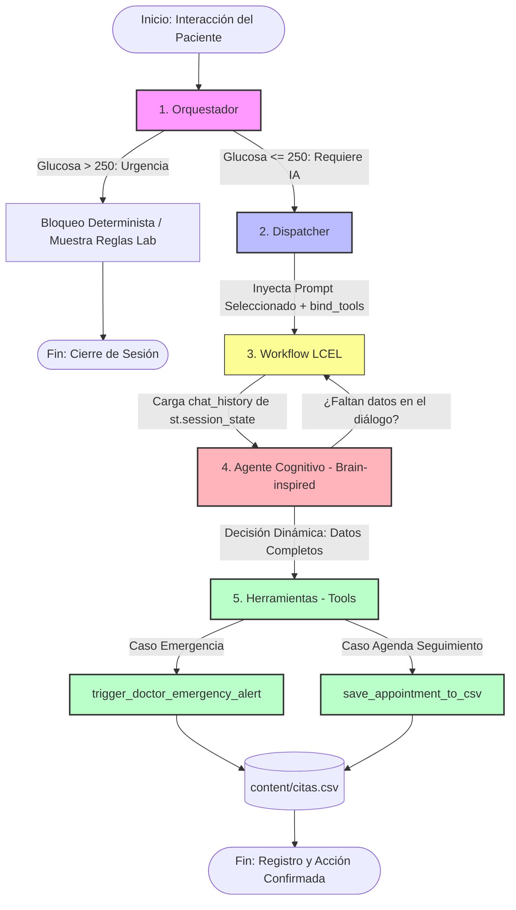

#### Resumen del Recorrido del Flujo:

1. **Entrada / Orquestador:** Evalúa la glucosa; si es una urgencia procedimental pura, detiene el flujo. Si califica para asistencia inteligente, decide qué contexto usar (Emergencia o Cita).
2. **Dispatcher:** Toma la decisión del Orquestador, arma el paquete de instrucciones y "despacha" el modelo amarrándole las herramientas necesarias (`bind_tools`).
3. **Workflow:** Gestiona el estado y la memoria de la conversación en bucle, inyectando el historial del chat cada vez que hay una nueva respuesta.
4. **Agente:** Procesa la información del usuario de manera cognitiva. Cuando determina que tiene el escenario completo, deja de hablar y llama a la acción.
5. **Herramientas:** Traducen la decisión de la IA en un cambio real del entorno, guardando la cita o disparando la alerta médica dentro del archivo físico `citas.csv`.

## 7. CONTROLES MINIMOS ESPERADOS

A continuación, se presenta un desglose exhaustivo sobre el estado de control actual del código, la confirmación de la estrategia de mitigación de riesgos, las mejoras arquitectónicas a futuro divididas por capas y una reflexión técnica integral de la solución.

---

## Identificación y Detalle de Controles Mínimos (Análisis del Código)

### A. Validación de Entrada

* **Estado actual en el código: Básico / Parcial.** En la capa web (Streamlit), se limpian espacios con `.strip()` en el login y el backend valida la existencia exacta del usuario cruzando con `.astype(str)`.
* En el motor conversacional **no hay validación rígida** antes de enviar los datos al LLM; el texto plano ingresado en `st.chat_input` se anexa directamente a `st.session_state["chat_history"]` sin pasar por un filtro previo de sanitización (limpiar y filtrar los datos proporcionados) de caracteres o inyecciones de código.


* **Validación de tipos en Tools:** Las herramientas exigen de manera determinista un argumento tipo cadena (`payload_str: str` y `summary_context: str`), delegando el análisis de sus estructuras internas (parseo) al comportamiento del LLM.

### B. Manejo de Errores en Herramientas (Tools)

* **Estado actual en el código:** **Robustez Local Implementada.**
* Ambas herramientas (`save_appointment_to_csv` y `trigger_doctor_emergency_alert`) envuelven la totalidad de su lógica operativa I/O en bloques descriptivos `try-except Exception as e`.
* **Comportamiento agéntico ante fallas:** Si ocurre una excepción (por ejemplo, el archivo CSV está bloqueado por el sistema operativo), la herramienta no rompe la ejecución de Python (`app.stop`). En su lugar, intercepta el error y le retorna un string descriptivo al Agente: `"SISTEMA: Error en persistencia..."`. Esto permite al LLM asimilar la falla del entorno e intentar comunicársela con lenguaje natural al paciente.


### C. Respuesta Clara cuando Falta Información

* **Estado actual en el código:** **Delegado implícitamente al Prompt (Few-Shot / Directivas).**
* No hay funciones explícitas en Python que verifiquen si faltan datos en la conversación.
* Este control es operado por el componente cognitivo mediante directivas explícitas del sistema en el `ChatPromptTemplate`. Al agente de emergencia se le instruye un *PROTOCOLO OBLIGATORIO* enumerado (1. Síntomas, 2. Ejercicio, 3. Carbohidratos), lo que obliga al modelo a iterar conversacionalmente hasta completar la captura antes de accionar la herramienta.


### D. Control de Temas Fuera del Dominio (Out-of-Domain)

* **Estado actual en el código:** **Muy Débil / Ausente.**
* El sistema limita el alcance definiendo un rol estricto en el prompt (`"Eres un asistente de triaje de Endocrinología..."` o `"Eres el asistente virtual encargado de agendar citas..."`).
* Sin embargo, debido a la ausencia de un clasificador de intenciones previo o capas de control semántico, si un paciente entrenado realiza ingeniería de prompts (*Prompt Injection*) o le solicita recetas de cocina, poemas o consejos de programación, el LLM gpt-4o/gpt-3.5-turbo podría salirse del rol médico al carecer de restricciones negativas explícitas (e.g., *"Si el usuario te pregunta algo ajeno a la diabetes o agendamiento, responde textualmente: Fuera de Dominio"*).


### E. Confirmación antes de Acciones Sensibles o Simuladas

* **Estado actual en el código:** **Automatizado / Sin doble factor.**
* El código rompe el estándar recomendado de interacción humana (*Human-in-the-loop*). Las instrucciones de sistema ordenan explícitamente: *"Al recopilar los datos, invoca de inmediato la herramienta..."* y *"Al confirmar los datos, ejecuta obligatoriamente el tool..."*.
* El Agente invoca y ejecuta la persistencia en el CSV de forma autónoma y transparente en el momento en que deduce cognitivamente que capturó los requerimientos mínimos, sin desplegar un botón físico de confirmación final para el paciente en Streamlit.


---

## 8. LANGSMITH

LangSmith plataforma de monitoreo, trazabildiad y depuración (hacer debugging) se integra a la solución ASISTENTE VIRTUAL MÉDICO IA para **optimizar el seguimiento de triaje y la gestión de Agendamiento del pacientes endocrinos (específicamente en control de diabetes).

* **.env** configuración de variables
  ```python
  LANGSMITH_TRACING=true
  LANGSMITH_ENDPOINT=https://api.smith.langchain.com
  LANGSMITH_API_KEY=[api_key]
  LANGSMITH_PROJECT="medical_assistant"
  ```
* **Tracing Application medical_assistant** ASISTENTE VIRTUAL MÉDICO IA

  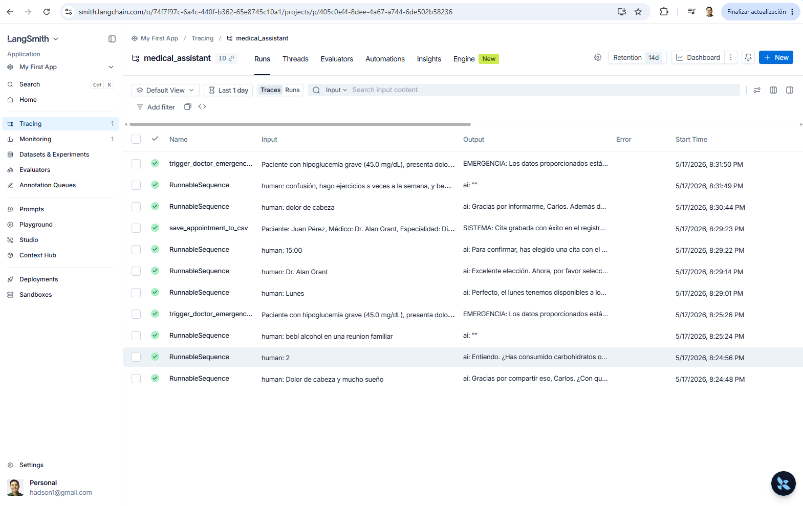

## 9. ENTREGABLES

## 🏥 Resumen: Asistente Virtual Médico IA

### 📌 Nombre del Proyecto y Propósito

**Asistente Virtual Médico IA:** Sistema inteligente diseñado para **optimizar el triaje y la gestión de agendamiento de pacientes endocrinos (específicamente en control de diabetes)**. Esto se logra mediante una **arquitectura híbrida** que combina de valores endocrinos de la diabetes, valores que son parte de las reglas de negocio que determina el funcionamiento y la flexibilidad cognitiva de agentes inteligente basado en LLMs (Large Language Models).

---

### 🚨 El Problema

Los pacientes con diabetes requieren un seguimiento constante de sus niveles de glucosa basal. Los sistemas de salud actuales enfrentan tres cuellos de botella críticos:

1. **Saturación en canales de atención:** Agendamientos manuales lentos que consumen tiempo del personal de enfermería.
2. **Falta de priorización médica inmediata:** Pacientes con crisis glucémicas (hipoglucemia o hiperglucemia severa) hacen filas virtuales o telefónicas idénticas a las de un paciente en control rutinario, poniendo en riesgo su salud.
3. **Inflexibilidad en la automatización tradicional:** Los chatbots basados en árboles de decisión rígidos frustran al usuario y no logran empatizar ni capturar síntomas complejos mediante lenguaje natural.

---

### 🔍 Análisis de la Solución

La solución radica en un **enfoque híbrido coordinado**. El sistema no depende enteramente de la IA (evitando respuestas aleatorias o alucinaciones en situaciones de riesgo vital), ni depende enteramente de un árbol de opciones cuadrado.

* Divide el problema en dos reinos: la **fase biomédica** (analizada con algoritmos exactos) y la **fase conversacional** (gestionada por la IA para guiar, calmar y estructurar datos).

---

### 🎯 Usuario Objetivo

El sistema cuenta con un Portal Clínico Multi-Rol enfocado en:

* **Pacientes Endocrinos / Diabéticos:** Usuarios que necesitan reportar sus niveles, recibir indicaciones de laboratorio inmediatas o coordinar citas de seguimiento sin fricción.
* **Personal Médico y de Enfermería:** Profesionales que requieren auditar el historial de alertas críticas disparadas, visualizar métricas analíticas del estado de la población atendida y gestionar la agenda médica liberados de la carga operativa inicial.

---

### 🏛️ Arquitectura de la Solución

El proyecto se rige bajo un patrón de **arquitectura desacoplada en 5 capas especializadas**, utilizando Python como motor central:

1. **Presentación (Frontend):** Streamlit + CSS dinámico para una interfaz limpia, interactiva y reactiva basada en estados de sesión (`st.session_state`).
2. **Lógica de Negocio (Control Clínico):** Motor determinista con Pandas que intercepta los datos de glucosa y dicta el camino a seguir sin intervención de la IA.
3. **Orquestación y Contexto (LangChain):** Componente que inyecta las reglas horarias, listas de médicos y gestiona la memoria activa del chat (`chat_history`).
4. **Inferencia (Modelos Fundacionales):** Modelos de OpenAI (`gpt-4o`/`gpt-3.5-turbo`) parametrizados a temperatura $0.0$ para un razonamiento clínico estricto y preciso.
5. **Integración y Datos (Persistencia/Tools):** Funciones nativas (`@tool`) que permiten al agente realizar acciones físicas permanentes, como guardar citas o disparar alertas en la base de datos local (CSV).

---

### ⚖️ Justificación Técnica y de Negocio

* **Seguridad Clínica:** Al aislar los extremos críticos (glucosa $< 70$ o $> 250\text{ mg/dL}$), se garantiza que un paciente en peligro reciba instrucciones protocolizadas de inmediato, cumpliendo con la responsabilidad médica.
* **Eficiencia Operativa:** Automatiza el 100% de la negociación de horarios de citas rutinarias, permitiendo al personal de salud enfocarse en la práctica clínica directa.
* **Costo-Efectividad:** La arquitectura híbrida filtra casos; los pacientes que solo requieren órdenes de laboratorio no consumen tokens de LLM (salida directa), optimizando los costos de API.

---

### 🛠️ Componentes Agénticos Usados

El motor inteligente se descompone bajo el estándar de la ingeniería de agentes:

* **Orquestador:** Decide dinámicamente qué prompt y qué restricciones de negocio activar según el triaje.
* **Dispatcher:** Vincula las herramientas nativas de Python al cerebro del LLM mediante `bind_tools`.
* **Workflows:** Modela la secuencia de ejecución de LangChain (LCEL) manteniendo el estado conversacional.
* **Agente (Cerebro):** Modela el comportamiento y razonamiento interactivo con el usuario.
* **Herramientas (Tools):** Funciones `save_appointment_to_csv` y `trigger_doctor_emergency_alert` que ejecutan las acciones en el sistema.

---

### 🔄 Flujo de Funcionamiento (Paso a Paso)

1. **Autenticación:** El paciente ingresa con su identificador único al portal.
2. **Triaje Inicial (Determinista):** El sistema extrae automáticamente su último nivel de glucosa del registro.
* *Si es $> 250\text{ mg/dL}$ (Urgencia):* Muestra inmediatamente los requisitos de preparación de laboratorio (`REGLAS_LABORATORIO_MD`) y cierra la sesión de forma segura.
* *Si es $< 70\text{ mg/dL}$ (Emergencia):* Activa el agente de crisis. La IA interroga interactivamente sobre síntomas mientras despliega recomendaciones de auxilio físico, disparando la alerta médica (`trigger_doctor_emergency_alert`).
* *Si está en rangos estables (entre 70.0 mg/dL y 250.0  mg/dL) para Control:* Activa el agente de agendamiento. La IA conversa amablemente, presenta los médicos disponibles, valida los horarios disponibles del negocio y guarda la reserva (`save_appointment_to_csv`).

3. **Auditoría y Dashboard:** El personal médico accede a los módulos de "Historial" y "Dashboard" para revisar los registros consolidados y analizar las estadísticas en tiempo real a través de gráficos de barras dinámicos.

---

### 🌐 Captura de la demo

* **Inicio de sesión:** Acceso a pacientes, enfermería y médicos.

  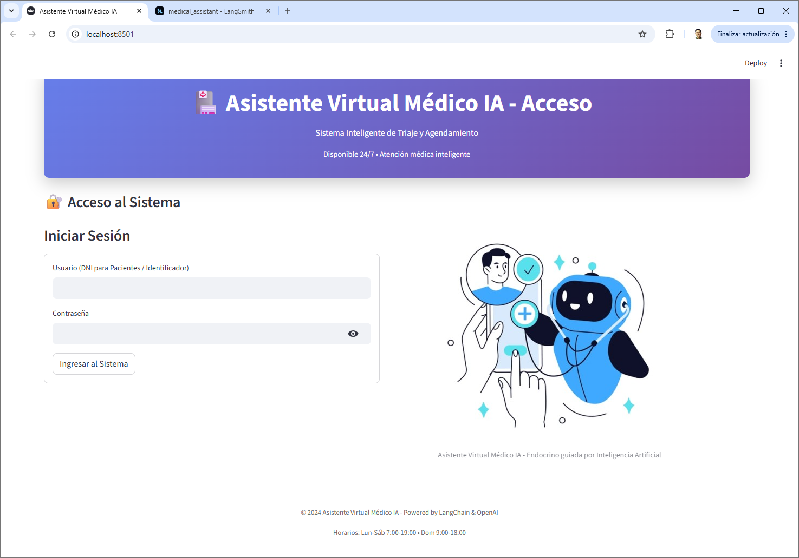

* **Portal Clínico** paciente con glucosa crítico.

  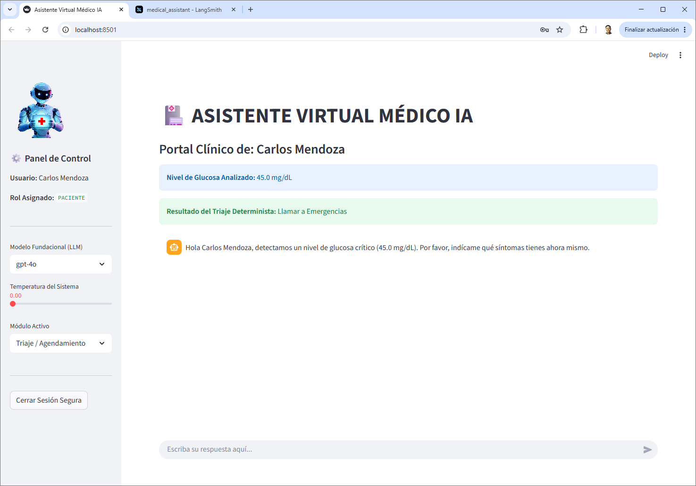

* **Portal Clínico:** Acceso para agendar cita.

  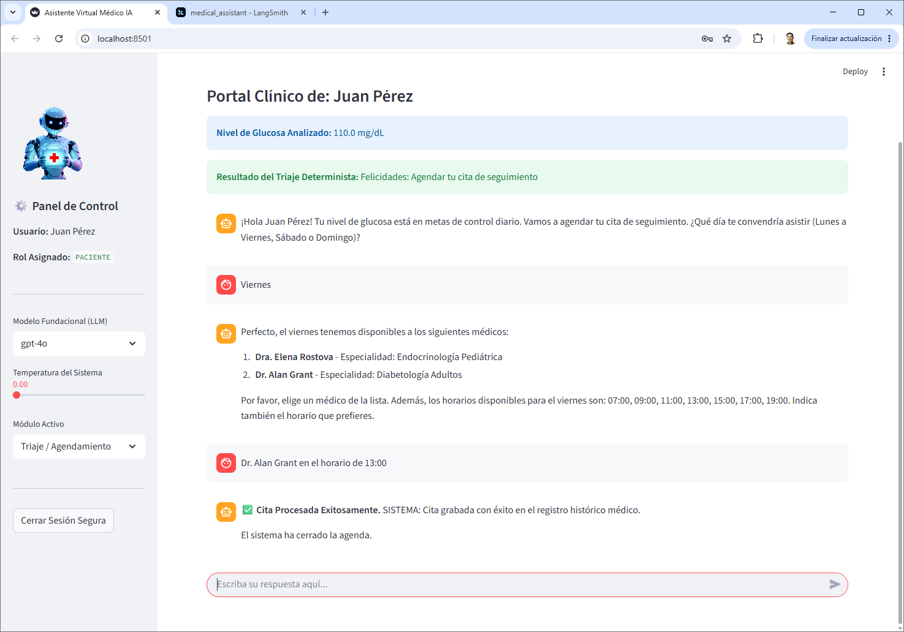

* **Portal Clínico:** Acceso para orden de laboratorio.

  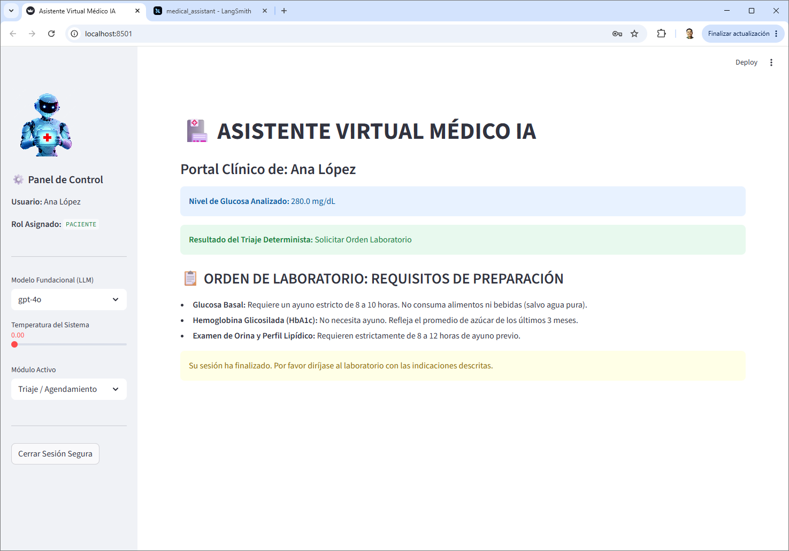

* **Portal Clínico:** Acceso a enfermería.

  

* **Portal Clínico:** Acceso a médicos.

  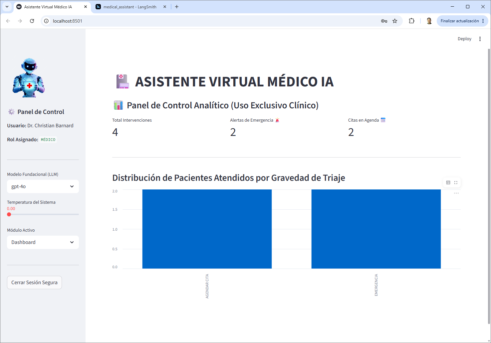

* La aplicación también se puede ejecutar desde el archivo `deterministic-agent-model-04.ipynb` ya sea desde Visual Studio Code estando en un entorno virtual (`.venv`) de Python o Anaconda Navigator o Colab.

* **Caso 1: AGENDAR CITA** (Prioridad de Seguimiento)

  * **Entrada de Usuario (ID):** `12345678`
  * **Datos Recuperados de la BD:** Juan Pérez — Glucosa: `110.0 mg/dL`
  * **Comportamiento del Sistema:** La capa determinista detecta que el valor se encuentra dentro del rango de Estabilidad (70 - 250 mg/dL).
  * **Salida por Pantalla:**
  ```text
  [Sistema]: Paciente localizado: Juan Pérez
  [Sistema]: Último registro de glucosa: 110.0 mg/dL

  [RESULTADO TRIAJE]: Categoría -> **AGENDAR CITA**
  [ACCIÓN DETERMINISTA]: Felicidades: Agendar tu cita de seguimiento

  [Sistema]: Flujo finalizado correctamente de acuerdo a las pautas de control. Sesión Cerrada.

  ```

* **Caso 2: URGENCIAS** (Prioridad Alta)

  * **Entrada de Usuario (ID):** `78912345`
  * **Datos Recuperados de la BD:** Ana López — Glucosa: `280.0 mg/dL`
  * **Comportamiento del Sistema:** La capa determinista evalúa la regla `glucose > 250.0`, clasificando al paciente inmediatamente en la categoría de Urgencia. El agente de IA no es instanciado en memoria protegiendo los costes de cómputo de la API.

  * **Salida por Pantalla:**
  ```text
    [Sistema]: Paciente localizado: Ana López
    [Sistema]: Último registro de glucosa: 280.0 mg/dL

    [RESULTADO TRIAJE]: Categoría -> **URGENCIAS**
    [ACCIÓN DETERMINISTA]: Solicitar Orden Laboratorio

    [Sistema]: Flujo finalizado correctamente de acuerdo a las pautas de control. Sesión Cerrada.

  ```

* **Caso 3: EMERGENCIA** (Prioridad Máxima + Flujo Agéntico)

  * **Entrada de Usuario (ID):** `45678912`
  * **Datos Recuperados de la BD:** Carlos Mendoza — Glucosa: `45.0 mg/dL`
  * **Comportamiento del Sistema:** La lógica condicional detecta un estado crítico de Hipoglucemia Grave (`< 70 mg/dL`). Imprime la alerta obligatoria e inicializa la capa agéntica conversacional. El agente no se detiene hasta consumir las respuestas del usuario y ejecutar el disparo de la herramienta de notificación médica.
  * **Salida por Pantalla:**

  ```text
    [Sistema]: Paciente localizado: Carlos Mendoza
    [Sistema]: Último registro de glucosa: 45.0 mg/dL

    [RESULTADO TRIAJE]: Categoría -> **EMERGENCIA**
    [ACCIÓN DETERMINISTA]: Llamar a Emergencias

    ============================================================
    INICIANDO ASISTENTE AGÉNTICO DE EMERGENCIA PARA: Carlos Mendoza
    Glucosa registrada: 45.0 mg/dL (Hipoglucemia Crítica)
    ============================================================

    [Agente]: Hola, soy tu asistente médico. Veo que tu nivel de glucosa es bajo (45.0 mg/dL). Por favor, dime cómo te sientes exactamente en este momento para poder ayudarte.

    [Paciente]: Hola, me siento muy mareado y estoy sudando frío. Esta semana solo hice ejercicio una vez, y no he tomado alcohol ni comido carbohidratos hoy.

    [SISTEMA]: Enviando payload de emergencia a la clínica...

    >>> EMERGENCIA: Los datos proporcionados están siendo notificados a tu médico, se recomienda llamar a emergencias. <<<

    ============================================================
    Sesión de Emergencia Finalizada con éxito. Busque ayuda médica inmediata.
    ============================================================

  ```

---

### ⚠️ Limitaciones Actuales

* **Persistencia Local (CSV):** Al utilizar archivos de texto plano, el sistema presenta riesgos de colisiones de escritura (*race conditions*) si múltiples usuarios interactúan en simultáneo. No es apto para entornos de alta concurrencia.
* **Falta de Confirmación Explícita:** El agente ejecuta las herramientas de forma autónoma cuando considera que tiene la información completa, omitiendo una validación de doble factor ("Human-in-the-loop") por parte del usuario antes de guardar los datos.
* **Ausencia de Guardrails Avanzados:** El control conversacional depende del *prompt engineering* del sistema. Carece de filtros perimetrales semánticos externos para bloquear por completo ataques de inyección de código o desvíos temáticos fuera del dominio endocrino.
* **Cumplimiento Normativo:** No cuenta con cifrado de datos ni anonimización de información médica protegida, lo que limita su despliegue comercial bajo normativas de salud como HIPAA o GDPR.

### ⚙️ Propuesta de Mejoras Futuras por Capas

Para escalar este prototipo a una solución de nivel empresarial e industrial de grado médico, se proponen las siguientes implementaciones:

```
[ Capa 1: UI ]       --> Implementar formularios dinámicos y deshabilitar chat post-firma.
[ Capa 2: Negocio ]  --> Migrar reglas rígidas a un Motor de Reglas Clínicas independiente.
[ Capa 3: Agentes ]  --> Sustituir cadenas LCEL lineales por Grafos de Estado con LangGraph.
[ Capa 4: Core IA ]  --> Validar payloads estructurados mediante Pydantic (Structured Outputs).
[ Capa 5: Data/Tools]--> Transicionar de CSV local a Base de Datos Relacional ACID con ORM.

```

### Capa 1: Presentación e Interfaz de Usuario (Streamlit Front)

* **Validación de Sesión Dinámica:** Reemplazar el formulario de texto plano por componentes de autenticación robustos basados en JWT u OAuth2 conectados a un proveedor de identidad (IdP).
* **Control de Interfaz Post-Acción:** Deshabilitar dinámicamente el cuadro de entrada de texto `st.chat_input` una vez que las herramientas de agenda o alerta hayan retornado el estatus de éxito, evitando que el usuario continúe enviando mensajes que dupliquen transacciones en la persistencia.

### Capa 2: Lógica de Negocio y Reglas Deterministas (Control Clínico)

* **Aislamiento de Criterios:** Migrar los umbrales de glucosa harcodeados ($70.0$ y $250.0$) fuera del código principal hacia un sistema de gestión de reglas de negocio (BRMS) o un archivo de configuración centralizado (`config.yaml`).
* **Enriquecimiento del Dataset:** Validar de forma cruzada la glucosa junto con otras variables deterministas esenciales (como la edad del paciente y horas de ayuno reportadas) antes de dictaminar la categoría del triaje.

### Capa 3: Contexto, Prompting y Orquestación (LangChain)

* **Evolución a Arquitectura de Grafos (LangGraph):** Reemplazar las cadenas secuenciales lineales (`prompt | llm`) por un desarrollo basado en grafos de estado (**LangGraph**). Esto permitirá definir ciclos de re-intento explícitos, manejo formal de fallas en los nodos y la capacidad de enrutar al paciente a sub-agentes especialistas.
* **Inyección Semántica Avanzada (RAG):** Sustituir el volcado de datos crudos en Markdown (`df_medicos.to_markdown()`) por una arquitectura de Generación Aumentada por Recuperación (RAG) utilizando una base de datos vectorial, permitiendo buscar médicos por cercanía geográfica, especialidades detalladas y horarios optimizados sin saturar la ventana de contexto del prompt.

### Capa 4: Inteligencia Artificial e Inferencia (Modelos Fundacionales)

* **Resultados Estructurados Obligatorios (Structured Outputs):** Forzar al LLM a comunicarse con las herramientas utilizando esquemas nativos estrictos mediante `.with_structured_output(PydanticModel)`. Esto garantiza que los argumentos pasados a la persistencia cumplan un formato estricto (por ejemplo, impidiendo que envíe texto libre en lugar de fechas normalizadas ISO-8601).
* **Guardrails Semánticos Explicítos:** Acoplar herramientas de inspección semántica como **Anyscale Doctor** o **Guardrails AI** para evaluar las entradas y salidas de la IA en tiempo real, bloqueando de raíz temáticas sensibles o no autorizadas (como diagnósticos farmacológicos explícitos ilegales).

### Capa 5: Integración, Herramientas y Almacenamiento (Data & Tools)

* **Evolución del Almacenamiento:** Abandonar el almacenamiento plano e inseguro basado en archivos CSV locales (`citas.csv`). Se debe migrar a una base de datos relacional robusta (como PostgreSQL) que asegure transacciones bajo propiedades **ACID**, gestionada mediante un Object-Relational Mapping (**SQLAlchemy** / **SQLModel**).
* **Herramientas de Doble Factor (Human-in-the-loop):** Modificar la ejecución de las herramientas críticas para que entren en un estado de "Pendiente de Aprobación", requiriendo que un componente de UI visualice un resumen final y exija la confirmación táctil o clic explícito del paciente antes de consolidar el registro médico en base de datos.

---

## 💡Reflexión Técnica de la Solución Actual

El diseño implementado en este módulo demuestra un excelente dominio del concepto de **Arquitectura Híbrida Inteligente**. Al reconocer que la medicina clínica no puede depender exclusivamente de la naturaleza probabilística de los modelos autorregresivos (LLMs), la aplicación antepone un escudo algorítmico determinista (Pandas) para tratar casos severos de hiperglucemia como contingencias procedimentales inmediatas. Esto ahorra valiosos tokens de inferencia y reduce a cero el riesgo de alucinación en un escenario donde la vida del paciente corre peligro inminente (Urgencias).

Por otro lado, para los escenarios grises o de variabilidad conversacional (recopilar síntomas de hipoglucemia leve o coordinar las preferencias horarias de un paciente para su cita de control), el sistema delega el control de forma correcta a la flexibilidad cognitiva de los agentes de LangChain utilizando enlace de herramientas nativas (`bind_tools`).

### Deuda Técnica Identificada:

1. **Concurrencia Comprometida:** El uso de archivos CSV locales mutados dinámicamente mediante operaciones de carga y sobreescritura completa (`pd.read_csv` -> `to_csv`) dentro de un entorno multipágina y multiusuario como Streamlit provocará colisiones físicas de escritura (*Race Conditions*) en cuanto dos o más pacientes intenten agendar una cita de manera simultánea.
2. **Seguridad y Privacidad de Datos (HIPAA / GDPR):** Los datos médicos protegidos (PHO) y las métricas biomédicas se almacenan en texto claro y se exponen íntegramente a un tercero (OpenAI) sin capas intermedias de anonimización o enmascaramiento de datos, incumpliendo normativas globales de gobernanza de datos de salud.

**Conclusión:** La solución actual califica como un **Producto Mínimo Viable (MVP) funcional de alto valor conceptual**, estructurado adecuadamente en sus capas de software, pero cuya escalabilidad operativa depende estrictamente de la transición de sus componentes de persistencia locales hacia microservicios modernos y la adición de sistemas formales de validación y seguridad agéntica.

## 10. CRITERIO PRINCIPAL DE EVALUACION

### Justificación estratégica y técnica de la solución:

La solución implementada para el **Asistente Virtual Médico IA** para pacientes endocrinos (específicamente en control de diabetes):

---

## 1. ¿Por qué se eligió un Agente, un Workflow o una Arquitectura Híbrida?

Se eligió una **Arquitectura Híbrida** porque la gestión de la salud (específicamente la endocrinología y el control de la diabetes) presenta dos naturalezas de problemas radicalmente opuestas que no pueden ser resueltas de manera óptima con un solo paradigma:

* **El componente Determinista (Workflow de Reglas Fijas):** El triaje médico inicial basado en métricas biomédicas cuantitativas (como el nivel de glucosa en sangre) exige una precisión del 100%. Un error de interpretación en un paciente con hipoglucemia grave ($< 70\text{ mg/dL}$) pone en riesgo su vida. Confiar esta clasificación crítica a un Modelo de Lenguaje de Gran Tamaño (LLM) —el cual es probabilístico por naturaleza— introduciría el riesgo latente de **alucinaciones clínicas**, lo cual es inaceptable en salud.
* **El componente Agéntico (Agente Inteligente con LLM):** Una vez superado el filtro de seguridad biomédica, la interacción humana (negociar una cita libre, calmar a un paciente con síntomas leves, recopilar datos cualitativos) requiere **flexibilidad cognitiva**. Los árboles de decisión tradicionales (*chatbots cuadrados de botones*) frustran al usuario y no entienden el contexto. El Agente Inteligente, dotado de razonamiento conversacional, se adapta a cómo habla el paciente y decide dinámicamente cuándo ha recopilado los datos suficientes para invocar una acción física.

---

## 2. ¿Qué componentes eran necesarios?

Para sostener esta arquitectura híbrida y cumplir el objetivo de negocio, se aislaron e implementaron únicamente cinco componentes esenciales:

1. **Un Filtro Predictivo Interceptor (Pandas Local):** Encargado de capturar el dato duro de glucosa del paciente antes de abrir cualquier canal de Inteligencia Artificial.
2. **Un Orquestador de Contexto Dinámico (LangChain Prompts):** Capaz de bifurcar el comportamiento del sistema y preparar "paquetes de instrucciones" (`SystemMessages`) específicos dependiendo del resultado del triaje (un prompt de crisis vs. un prompt de negociación de agenda).
3. **Un Motor de Inferencia Cognitiva Estricto (OpenAI GPT):** Configurado obligatoriamente con **Temperatura 0.0** para anular la creatividad del modelo, forzándolo a actuar como un agente de triaje lógico y directo.
4. **Herramientas de Ejecución en el Mundo Real (Tools con `@tool`):** Funciones nativas de Python (`save_appointment_to_csv` y `trigger_doctor_emergency_alert`) que le dan "manos" al agente para impactar permanentemente la base de datos de la clínica cuando su razonamiento concluye.
5. **Una Interfaz de Usuario Centralizada Multi-Rol (Streamlit):** Necesaria para segregar las vistas por privilegios (Portal del Paciente vs. Dashboard de Analítica Médica).

---

## 3. ¿Qué componentes se decidió NO usar?

En un ejercicio de diseño arquitectónico responsable, se descartaron activamente componentes que habrían sobre-ingenierizado la solución en esta etapa:

* **Bases de Datos Vectoriales y Arquitecturas RAG Complejas:** Dado que el catálogo de médicos disponibles (`medicos04.csv`) y las reglas horarias clínicas eran datos estructurados de tamaño acotado, se prefirió inyectarlos directamente en formato Markdown dentro de la ventana de contexto del prompt. Introducir una base de datos vectorial (como Chroma o Pinecone) y un pipeline de embeddings habría añadido latencia, costos y complejidad innecesaria.
* **Frameworks de Agentes Multimodales o Multi-Agente (CrewAI / AutoGen):** Resolver el agendamiento y la alerta de emergencia no requiere que múltiples agentes "conversen entre sí" o simulen reuniones de departamentos. Un único agente monolítico bien acotado mediante roles (`bind_tools`) es más que suficiente, evitando bucles infinitos de ejecución y consumos disparados de créditos de API.
* **Modelos Open Source Locales (Ollama / Llama 3):** Para un MVP médico, la prioridad era la velocidad de respuesta y la madurez en el seguimiento de funciones (*Function Calling*). Alojar un modelo local habría exigido infraestructura dedicada (GPUs) y configuraciones de hardware complejas, alejando el enfoque del valor del negocio.

---

## 4. ¿Cómo se aplicó el principio de Mínima Complejidad?

La arquitectura aplica el principio de mínima complejidad al resolver cada problema con la tecnología más simple y económica que sea capaz de garantizar el resultado:

* **Bloqueo Prematuro de Recursos (Salida Directa):** Si el paciente registra una glucosa catastrófica ($> 250\text{ mg/dL}$), el sistema despliega el Markdown estático de preparación de laboratorio y detiene la ejecución inmediatamente (`st.stop()`). **No se crea el agente, no se instancia el LLM y no se realiza ninguna llamada a la API.** La complejidad conversacional se reduce a cero cuando el procedimiento médico ya está estandarizado por escrito.
* **Persistencia Plana Transicional (CSV):** En lugar de configurar servidores de bases de datos relacionales (MySQL/PostgreSQL) con esquemas de migración y ORMs complejos, se optó por una lectura/escritura directa en dataframes de Pandas hacia archivos CSV locales. Esto permite validar la lógica integral del negocio y la estructura de los payloads sin fricción de infraestructura.
* **Memoria en Estado de Sesión Nativo:** El almacenamiento del historial conversacional se delegó al `st.session_state["chat_history"]` nativo de Streamlit, evitando integrar bases de datos de memoria intermedias (como Redis).

---

## 5. ¿Qué valor aporta la solución al problema de negocio?

La implementación de este ***Asistente Virtual Médico Híbrido** transforma drásticamente los indicadores operativos de la gestión clínica:

* **Mitigación Total del Riesgo Clínico (Seguridad del Paciente):** Al automatizar alertas críticas mediante el triaje determinista, el sistema asegura que un paciente con hipoglucemia grave sea detectado en milisegundos y enrutado a una alerta activa de guardia, eliminando las colas de espera humanas que ponen en peligro vidas.
* **Liberación de Carga Operativa Hospitalaria:** Al delegar la negociación de citas, horarios disponibles y la repetición de instrucciones de preparación de laboratorio en la IA, el personal de enfermería y secretaría médica recupera hasta un 70% de su tiempo libre, permitiéndoles enfocarse en la atención presencial de alta complejidad.
* **Optimización Financiera del Consumo de IA (ROI):** Al filtrar los casos estricto-procedimentales, la clínica ahorra miles de tokens en interacciones innecesarias. La inteligencia artificial se paga y se consume únicamente en los escenarios donde el razonamiento dinámico y la empatía conversacional son estrictamente requeridos.
* **Gobernanza y Visibilidad Directa (Dashboard):** El personal médico adquiere, por primera vez, un panel analítico centralizado que procesa los payloads grabados por los agentes. Esto permite ver en tiempo real cuántas alertas críticas se han disparado en el día y cómo está distribuida la gravedad de la población diabética atendida.

---

*Documentación elaborado por [Hadson Paredes](https://www.linkedin.com/in/hadson-paredes/) - 2026*
- Repositorio [Project-Agentic-AI-Virtual-Medical-Assistant](https://github.com/devhadson/Project-Agentic-AI-Virtual-Medical-Assistant)
- Disponible como recurso públicos en [Hadson.Tech](https://hadson.tech/public-resources/project-agentic-ai/project-agentic-ai-virtual-medical-assistant)

<hr>
<h4 align="center"> Publicaciones en mis redes sociales y repositorio GitHub</h4>

<div align="center">
  <h3>Sígueme en mis redes sociales</h3>
  <a href="https://github.com/devhadson">
    
  </a>
  <a href="https://www.linkedin.com/in/hadson-paredes/">
    
  </a>
  <a href="https://www.facebook.com/hadson.paredescordova/">
    
  </a>
  <a href="https://x.com/hadson_paredes">
    
  </a>
</div>